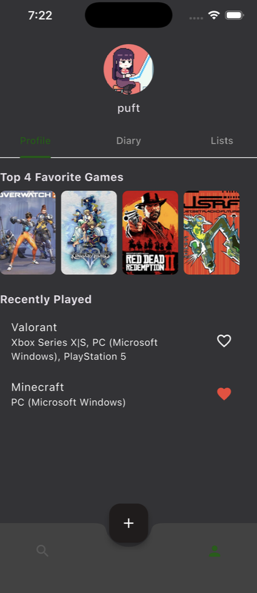
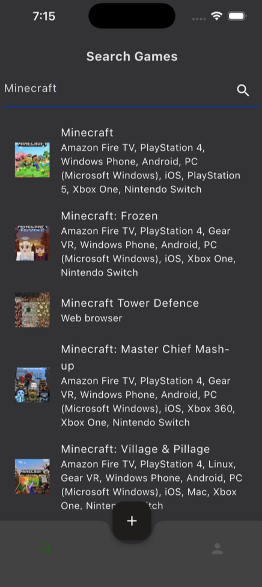
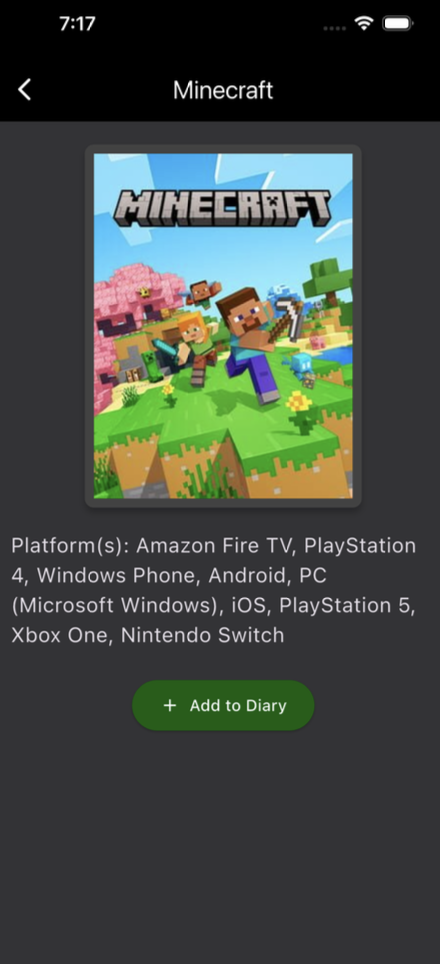
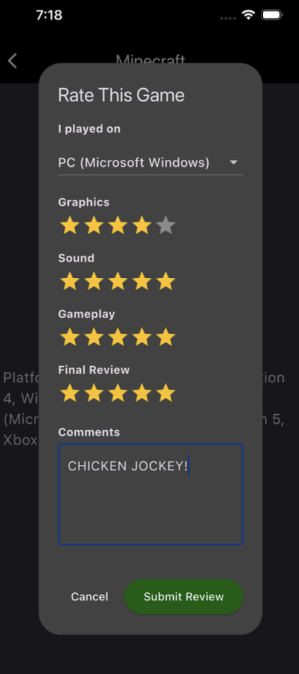
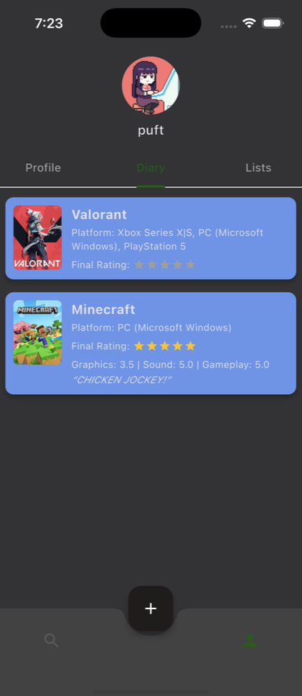
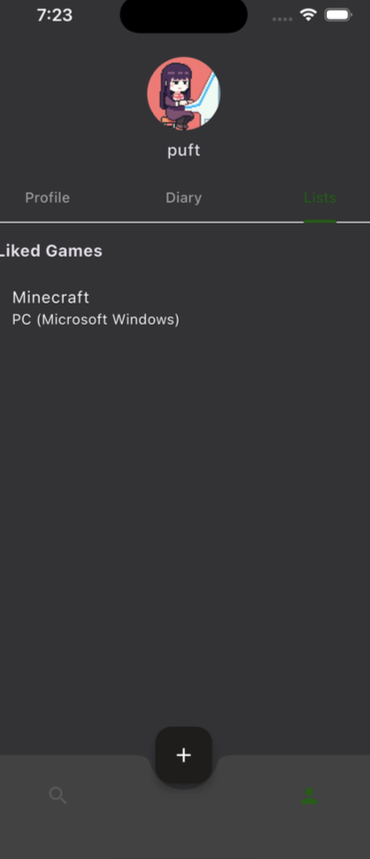

# 🎮 gamed. — Video Game Diary App

**Technologies:** Flutter, SQLite, IGDB API  
**Role:** Full-Stack Developer  
**Type:** Graduate & Personal Project  

## Overview
*gamed.* is a cross-platform mobile application designed to help users track video game reviews, ratings, and favorites in a personal diary format. 
The project emphasizes frontend-focused mobile development, intuitive navigation, and reliable local data persistence, while integrating third-party APIs for live game metadata.
The application was built to deliver a clean, accessible user experience and to demonstrate practical mobile software engineering concepts such as state management, API consumption, 
and offline data storage.

---

## Key Features
- Search games via external API
- Diary-style game reviews with ratings
- Multi-category rating system (Graphics, Sound, Gameplay, Final)
- Favorites & custom lists
- Local persistence using SQLite (`sqflite`)
- Dark-mode focused UI design
- Bottom navigation with FAB-driven actions

---

## Engineering Focus
Frontend development • Mobile UI/UX • API integration • Local data persistence • User-centered design

---
## What I learned
- How to built a cross-platform mobile application using Flutter with a strong emphasis on reusable UI components and responsive layouts.  
- Gained hands-on experience managing local data persistence with SQLite to support offline access and fast read/write operations.  
- Integrated a third-party API (IGDB) and designed clear data flow between external services and frontend views.  
- Improved frontend usability through iterative refinement focused on navigation clarity, accessibility, and performance.  

---
## Rationale
- Flutter was chosen to enable rapid iteration and consistent UI behavior across platforms using a single codebase.  

- SQLite was used to prioritize performance, reliability, and offline-first functionality for user-generated content.  
    
- IGDB API provided authoritative game metadata, allowing the app to focus on user interaction rather than data management.  
  
- Design decisions emphasized simplicity and low friction, ensuring users could search, review, and organize games efficiently.  

---

## Architecture Overview

- **UI Layer:** Flutter widgets (screens, dialogs, components)
- **Controllers:** Handle business logic and state coordination
- **Models:** Strongly-typed data models for games, users, and reviews
- **Database:** Local SQLite database using `sqflite`
- **Services:** External API integration for game search

---

## Why This Project Matters

gamed demonstrates real-world mobile development concepts including:
- Full CRUD workflows
- Persistent local storage
- API-driven search
- Modular architecture
- Production-style UI patterns

This project is representative of how I approach building maintainable, user-focused mobile applications.

---

## System Artifacts

### User Profile

### Search Games Interface

### Game Detail View

### Game Review & Rating UI

### Diary View

### User Lists

---
*(Source code maintained in a private repository — details and walkthroughs available upon request.)*
