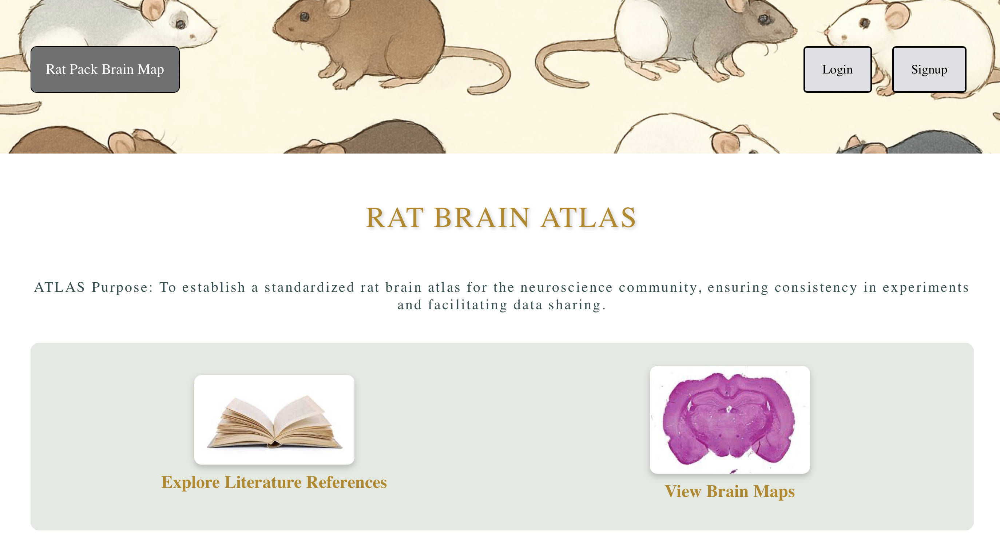
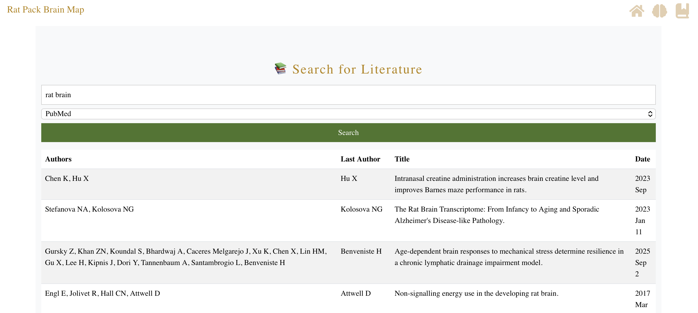
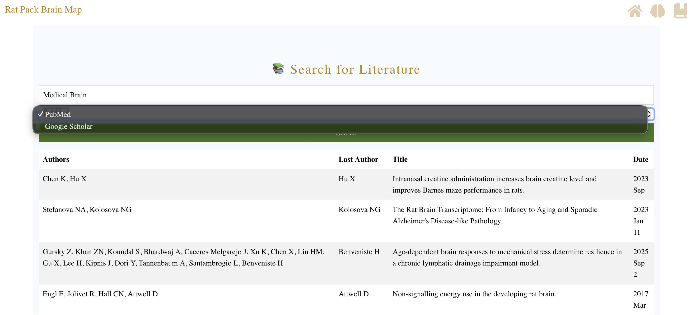
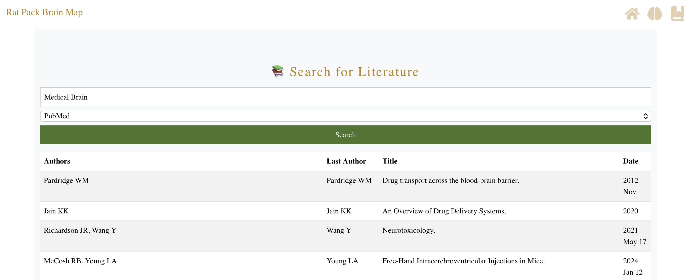
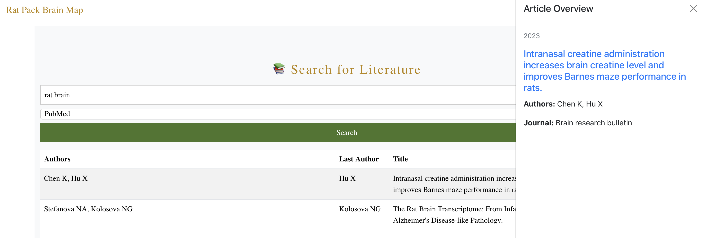
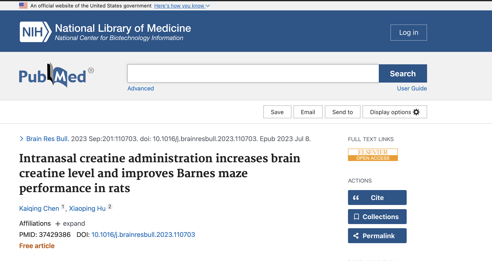

# 🧠 Rat Brain Atlas — Research Visualization Tool

Technologies: React, Firebase, D3.js, NCBI E-utilities API  
Role: Frontend Developer & Project Collaborator  
Type: Graduate Practicum Project  

---

## Overview

Rat Brain Atlas is an interactive, web-based visualization tool designed to support research-driven exploration of rat brain anatomy. 
The application enables users to navigate anatomical brain regions through dynamic SVG-based visualizations while integrating relevant scientific literature through PubMed search.

The project emphasized frontend architecture, data visualization, and usability within a research context, delivering an accessible and 
responsive interface suitable for exploratory analysis.

---

## Key Features

- Developed dynamic, data-driven SVG visualizations using D3.js to represent anatomical brain structures
- Built a responsive React-based frontend using component-driven design principles
- Integrated PubMed article search functionality via the NCBI E-utilities API
- Implemented Firebase-backed image storage to support anatomical reference materials
- Designed with accessibility and usability in mind for research-focused workflows

---

## Engineering Focus

Frontend development • Data visualization • API integration • Research-oriented UX • Accessibility

---

## System Artifacts

### Homepage

### Literature Search Interface

### API Source Selection (PubMed / Google Scholar)

### Search Results View

### Article Overview Panel

### External Link Usage

---

*(Private repository — source code available upon request.)*
